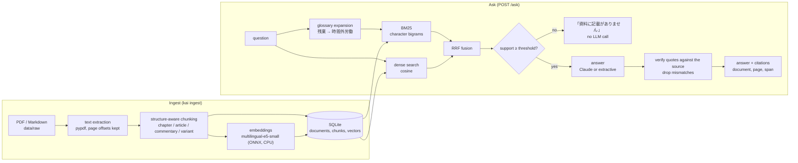

# AI総務さん (AI General-Affairs Assistant) — citation-first RAG for Japanese company rules

[日本語 README](README.md)

Employees ask "How many days of paid leave do I get?" or "Am I allowed a side job?". This app answers **with citations — document, page and the exact quoted span —** and says **「資料に記載がありません」 ("the documents don't say")** when the documents don't support an answer.

- Demo corpus: the Ministry of Health, Labour and Welfare's *Model Rules of Employment* (モデル就業規則, December 2025 edition, 94 pages) plus a short fictional expense policy.
- Works **without any LLM API key** in extractive mode (answers by quoting the source verbatim). With `ANTHROPIC_API_KEY` set, Claude writes the answer.
- Retrieval quality and abstention quality are **measured** on a 97-question evaluation set (below).

## Problem

| Situation | What this app does |
|---|---|
| HR keeps answering the same questions; the rules are a 50–300 page PDF | Shows the relevant article and commentary immediately |
| General-purpose chatbots answer plausibly from general or legal knowledge | Every answer carries verbatim quotes; quotes that don't match the source are discarded, and no answer is given without evidence |
| Nobody can say how accurate the assistant is | A labelled eval set and script report retrieval recall and abstention precision/recall |

## Measured results

From `make eval`; full report: [`reports/eval-2026-10-07.md`](reports/eval-2026-10-07.md) (raw numbers in the matching `.json`).
Eval set: 97 questions (81 answerable, 16 unanswerable), split dev 49 / test 48.

**Retrieval** (81 answerable questions; a chunk is relevant if it contains ≥50% of a gold evidence quote)

| mode | Recall@1 | Recall@3 | Recall@5 | MRR@10 |
|---|---|---|---|---|
| BM25 (character bigrams) | 72.8% | 86.4% | 95.1% | 0.815 |
| dense (multilingual-e5-small) | 70.4% | 91.4% | 93.8% | 0.808 |
| **hybrid (RRF)** | **77.8%** | **93.8%** | **96.3%** | **0.861** |

Hybrid retrieval takes about 10 ms per question (median, 4 CPU cores).

**Abstention** (did it decline the questions it should decline? measured end to end in extractive mode)

| set | precision | recall | answerable questions wrongly refused |
|---|---|---|---|
| all 97 | 77.8% | 87.5% | 4.9% (4 of 81) |
| test 48 (threshold chosen on dev only) | 85.7% | 75.0% | 2.5% (1 of 40) |

**Answer quality, extractive mode (no LLM):** answered 77 of 81 answerable questions; 71.4% contain the expected key phrase; in 66.2% a citation overlaps the gold evidence.

**Answer quality with Claude: not measured** — no API key was available in this environment. The eval script implements it: run `make eval` with `ANTHROPIC_API_KEY` set and the report adds abstention precision/recall, the share of citations rejected by verification, tokens and cost.

> Caveats: the questions were written by the author after reading the corpus, so their wording is probably closer to the documents than real employee questions. Retrieval design choices (merging label-only chunks, the glossary) were made while looking at failures across all questions, so test-split retrieval numbers are not a pure held-out estimate. Only the abstention threshold and weights were selected on dev alone.

## Architecture



## Design decisions (ADR style)

1. **Hybrid retrieval with RRF.** Rule questions mix exact terms (「第23条」, 「60時間」) and paraphrases (「給料日前にお金が必要」). BM25 wins at Recall@1, dense wins at Recall@3; fused, the hybrid beats both on every metric (MRR 0.815 / 0.808 → 0.861). RRF uses ranks only, so it needs no calibration between unbounded BM25 scores and e5 cosines that sit in a narrow 0.75–0.92 band.
2. **Character bigrams instead of a morphological analyser.** No 50–100 MB dictionary to install, robust to compounds and unknown words; PDF line wraps inside words are ignored. Measured BM25 Recall@1 / MRR: unigrams 70.4% / 0.807, **bigrams 72.8% / 0.815**, bigrams+unigrams 76.5% / 0.849, trigrams 56.8% / 0.676. Adding unigrams helps BM25 alone but not the hybrid that ships (77.8% / 0.861 vs 76.5% / 0.855), so the smaller bigram index stays.
3. **Abstain twice: at retrieval and at citation verification.** Support = IDF-weighted query-term coverage + 4·(dense similarity − 0.80); threshold 0.40 and weight 4 were chosen on the dev split only (AUROC: dense 0.970, lexical 0.917, combined 0.975). Below the threshold the service answers 「資料に記載がありません」 **without calling the LLM** (no general-knowledge answers, zero cost). Every quote the LLM returns is matched character by character against the source (only whitespace and full/half-width differences are tolerated); unmatched quotes are dropped, and an answer left with no verified citation becomes an abstention.
4. **Chunk along the document's structure; label gold answers with evidence quotes.** Chunks follow 章 / 条 / 解説 / ［例N］, and only long articles are split, at paragraph/item boundaries (then at 「。」). Chunk ids come from the structure (`mhlw-model-rules#art023`), so they are stable across re-ingestion. Gold labels are verbatim evidence quotes, not chunk ids, so the eval set survives chunking changes and the thing being evaluated never defines its own ground truth.
5. **SQLite + numpy behind `ChunkStore` / `VectorIndex` interfaces.** A rules corpus is hundreds to a few thousand chunks; exact cosine search takes milliseconds and the whole index is one file baked into the image. A pgvector implementation of the same interfaces would slot in without changes above the store (not implemented in this round).
6. **Claude with structured outputs; retrieved text is data.** The answer is constrained to a JSON schema (`answerable`, `answer`, `citations[{source_id, quote}]`) and validated with pydantic. Sources and the question are wrapped in tags with `<`/`>` replaced by full-width characters so content cannot close a tag; the system prompt says instructions inside tags are data. A unit test feeds a document containing "ignore previous instructions…" and checks it is passed as data. Default model `claude-haiku-4-5-20251001`; switch with `KAI_CLAUDE_MODEL=claude-sonnet-5-5`.
7. **Glossary query expansion.** Employees say 残業 / 有給 / 天引き; rules say 時間外労働 / 年次有給休暇 / 控除. A 34-entry editable glossary expands the BM25 query only. Measured: hybrid Recall@5 93.8% → 96.3%, MRR 0.837 → 0.861.

## Cost per question — ESTIMATE, not measured

Measured mean prompt size: 3,331 characters (system prompt + top-5 chunks + question). **Assumed**: 0.8–1.3 tokens per character and 250 output tokens. Anthropic list prices per million tokens as of September 2026.

| model | input / output price | per question (est.) | per 1,000 questions (est.) |
|---|---|---|---|
| Claude Haiku 4.5 (`claude-haiku-4-5-20251001`) | $1 / $5 | $0.0039–$0.0056 | $3.9–$5.6 |
| Claude Sonnet 5.5 (`claude-sonnet-5-5`) | $2 / $10 | $0.0078–$0.0112 | $7.8–$11.2 |

Questions stopped by the retrieval gate cost nothing. With an API key, `make eval` reports cost from the token usage the API actually returns.

## Running it

Requires Python ≥ 3.12 (tested on 3.13) and `uv` (falls back to `pip`).

```bash
make setup    # .venv, pinned dependencies, embedding model (~470 MB)
make ingest   # index data/raw → var/index.sqlite (~30 s)
make run      # web UI + API on http://127.0.0.1:8000
make test     # unit + API tests (no network, no API key)
make eval     # writes reports/eval-<date>.md
make lint     # ruff
```

With Claude (without a key the app falls back to extractive mode automatically):

```bash
export ANTHROPIC_API_KEY=sk-ant-...
make run                                      # Haiku 4.5
KAI_CLAUDE_MODEL=claude-sonnet-5-5 make run   # Sonnet 5.5
```

Docker — the model and the index are built into the image, so at runtime the container only needs the Claude API; it runs as a non-root user on a read-only filesystem:

```bash
docker compose up --build    # http://localhost:8000
```

Configuration is via `KAI_*` environment variables (see [`src/knowledge_ai/config.py`](src/knowledge_ai/config.py) and `.env.example`): provider and model, abstention threshold, top-k, per-IP per-minute and daily limits, a global daily cap (resets at midnight Asia/Tokyo), and whether to trust `X-Forwarded-For`.

API: `POST /ask {"question": "..."}` returns the answer, `abstained`, and citations with `quote`, `page`, `heading`, `chunk_text` and the quote's offsets for highlighting; `GET /documents` lists sources with attribution; `GET /health` reports readiness.

## Limitations

- Tables (e.g. the paid-leave table) lose their row/column structure in PDF text extraction; structured table extraction is the next improvement.
- Scanned (image-only) PDFs need OCR, which is not implemented.
- Structure detection targets Japanese rules formatting (第N条, （見出し）, 【解説】, ［例N］); other documents fall back to heading/paragraph chunks.
- Extractive mode only selects and quotes sentences; it cannot summarise or reason (key-phrase hit rate 71.4%).
- **The Claude path is unit-tested with a fake client (request shape, parsing, refusal/truncation handling, citation verification) but was not run against the real API for this report.**
- Small, author-written eval set (16 unanswerable questions: one question moves recall by 6.2 points).
- Rate limits live in process memory (use Redis when running several workers); no authentication, per-user permissions or multi-tenancy.
- pgvector: interface only.
- Answers are generated from the documents and are not legal advice.

## Sources and licences

- 厚生労働省「モデル就業規則」（令和7年12月版）, https://www.mhlw.go.jp/stf/seisakunitsuite/bunya/koyou_roudou/roudoukijun/zigyonushi/model/index.html, used under the Public Data License 1.0 (PDL1.0, compatible with CC BY 4.0, https://www.digital.go.jp/resources/open_data/public_data_license_v1.0). This app modifies it (text extraction, chunking, indexing). Its answers are not the Ministry's views.
- The expense policy is a fictional document written for this repository.
- Embedding model: `intfloat/multilingual-e5-small` (MIT License).
- Details: [`data/SOURCES.md`](data/SOURCES.md)
